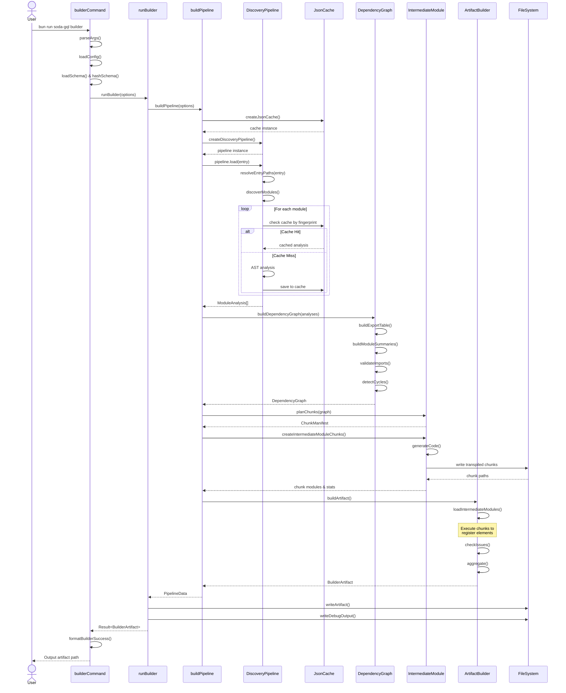
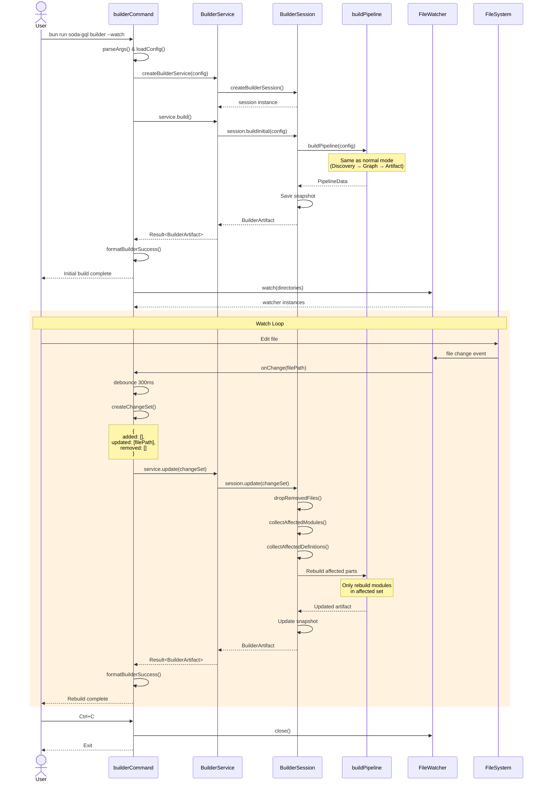

# Builder Processing Flow

This document describes the processing flow of the soda-gql builder system.

## Overview

The builder has two modes of operation:
1. **Normal Mode**: Single build execution
2. **Watch Mode**: Continuous incremental builds with file watching

## Sequence Diagram

### Normal Mode (Single Build)



### Watch Mode (Incremental Build)



## Processing Phases

### 1. Discovery Phase (Purple)

**Purpose**: Discover and analyze all GraphQL definitions in the codebase

**Steps**:
- `resolveEntryPaths`: Resolve entry file paths from glob patterns
- `discoverModules`: Recursively discover all modules starting from entry files
- `ASTAnalysis`: Parse TypeScript files and extract GraphQL definitions
- **Cache Check**: Skip analysis for unchanged files based on fingerprint

**Key Files**:
- `packages/builder/src/discovery/discovery-pipeline.ts`
- `packages/builder/src/discovery/discoverer.ts`

**Output**: `ModuleAnalysis[]` - Array of analyzed modules with GraphQL definitions

---

### 2. Dependency Graph Phase (Green)

**Purpose**: Build a dependency graph of all GraphQL definitions

**Steps**:
- `buildExportTable`: Build a table of all exports from each module
- `buildModuleSummaries`: Summarize imports and exports for each module
- `validateImports`: Ensure all imports can be resolved
- `detectCycles`: Check for circular dependencies

**Key Files**:
- `packages/builder/src/dependency-graph/builder.ts`
- `packages/builder/src/dependency-graph/export-table.ts`
- `packages/builder/src/dependency-graph/summaries.ts`
- `packages/builder/src/dependency-graph/cycles.ts`

**Output**: `DependencyGraph` - Map of canonical IDs to graph nodes

---

### 3. Intermediate Module Phase (Yellow)

**Purpose**: Generate intermediate runtime modules for execution

**Steps**:
- `planChunks`: Determine how to split definitions into chunks
- `createIntermediateModuleChunks`: Generate TypeScript code for each chunk
- `writeChunks`: Write and transpile chunk files to disk

**Key Files**:
- `packages/builder/src/internal/intermediate-module/chunks.ts`
- `packages/builder/src/internal/intermediate-module/emitter.ts`
- `packages/builder/src/internal/intermediate-module/codegen.ts`

**Output**: Transpiled chunk files in `.cache/soda-gql/builder/runtime/`

---

### 4. Artifact Phase (Yellow)

**Purpose**: Load intermediate modules and build the final artifact

**Steps**:
- `loadIntermediateModules`: Execute intermediate modules to register elements
- `checkIssues`: Validate registered elements and collect warnings
- `aggregate`: Classify and aggregate all elements by type
- `writeArtifact`: Write final artifact JSON to output path

**Key Files**:
- `packages/builder/src/artifact/builder.ts`
- `packages/builder/src/artifact/loader.ts`
- `packages/builder/src/artifact/aggregate.ts`

**Output**: `BuilderArtifact` - Final JSON artifact with all GraphQL operations

---

### 5. Watch Mode (Orange)

**Purpose**: Continuously watch for file changes and perform incremental builds

**Components**:
- `BuilderService`: Stateful service that maintains a `BuilderSession`
- `BuilderSession`: Tracks previous build state for incremental updates

**Incremental Build Process**:
1. File watcher detects changes (debounced 300ms)
2. Create `BuilderChangeSet` with added/updated/removed files
3. `session.update(changeSet)`: Perform incremental update
   - Collect affected modules based on dependency graph
   - Collect affected definitions
   - Rebuild only affected parts
4. Output updated artifact

**Key Files**:
- `packages/builder/src/service.ts`
- `packages/builder/src/internal/session/builder-session.ts`
- `packages/cli/src/commands/builder.ts` (watch mode logic)

---

## Error Handling

All phases use `neverthrow`'s `Result<T, E>` type for type-safe error handling:

- **Config errors**: Invalid configuration or missing files
- **Schema errors**: Failed to load or parse GraphQL schema
- **Discovery errors**: Failed to analyze modules or parse AST
- **Graph errors**: Circular dependencies or missing imports
- **Artifact errors**: Failed to load intermediate modules or validation errors

Errors are propagated up the call stack and formatted for output using `formatBuilderError()`.

---

## Entry Points

### CLI Entry
```bash
bun run soda-gql builder --mode runtime --entry ./src/**/*.ts --out ./artifact.json
```

Location: `packages/cli/src/commands/builder.ts:builderCommand`

### Programmatic Entry
```typescript
import { runBuilder } from "@soda-gql/builder";

const result = await runBuilder({
  mode: "runtime",
  entry: ["./src/**/*.ts"],
  outPath: "./artifact.json",
  analyzer: "swc",
  config: loadedConfig,
  schemaHash: "...",
});
```

Location: `packages/builder/src/runner.ts:runBuilder`

---

## Cache Strategy

The builder uses a multi-level cache strategy:

1. **Discovery Cache**: Module analysis results cached by file fingerprint
2. **Chunk Cache**: Intermediate modules cached by content hash
3. **Session State**: Watch mode maintains previous build state

Cache invalidation is based on:
- File fingerprint (content hash + mtime)
- Schema hash
- Analyzer version

---

## Performance Considerations

- **Cache hits**: Skip AST analysis for unchanged files
- **Incremental builds**: Only rebuild affected modules in watch mode
- **Parallel processing**: Module analysis can be parallelized (future enhancement)
- **Chunk optimization**: Minimize chunk count to reduce module loading overhead
